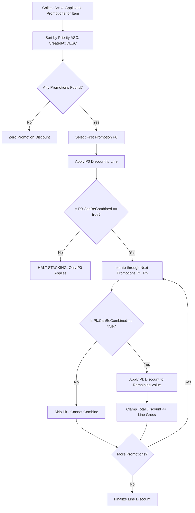
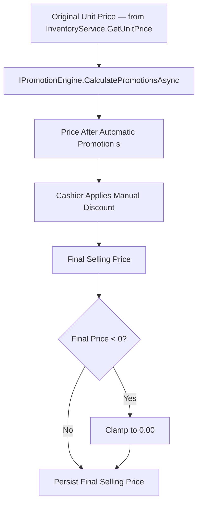
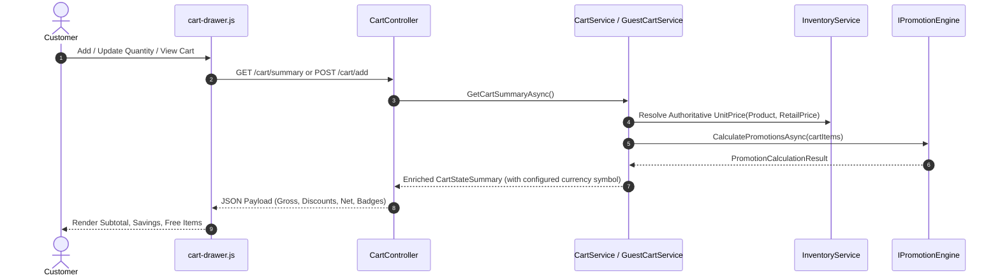
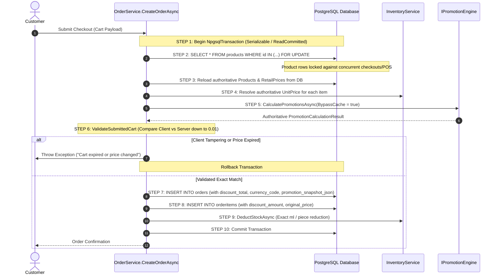
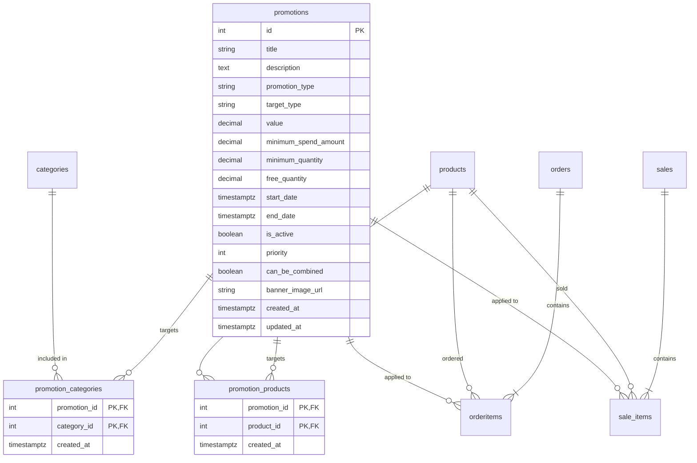
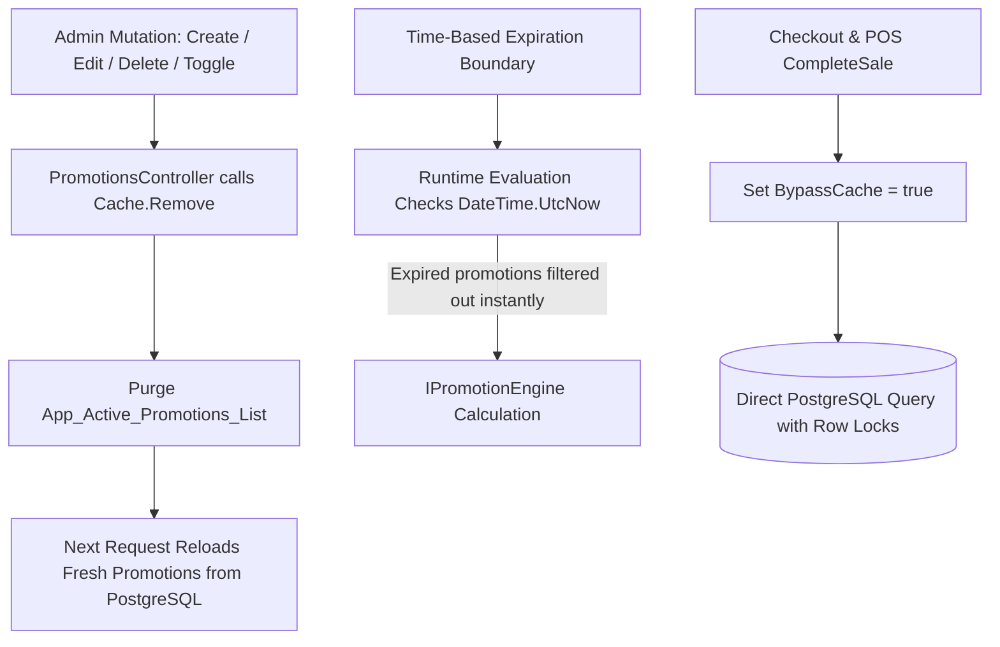
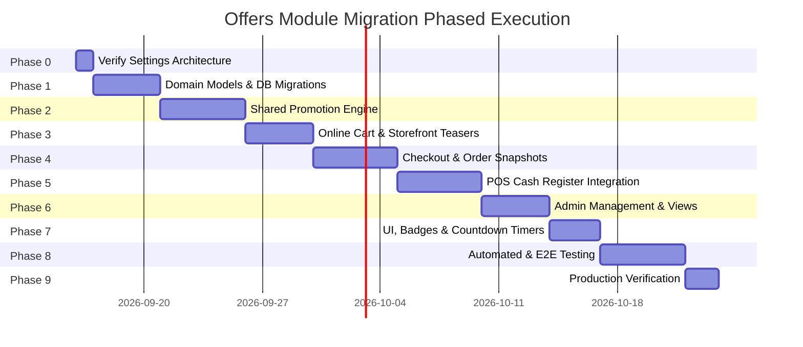

# OFFERS / PROMOTIONS MODULE MIGRATION SPECIFICATION
## Architectural Blueprint & Technical Integration Plan for YAGOT 2.0 (TemSite)

---

### Document Metadata
- **Document Title**: Formal Migration Specification: Offers & Promotions Module Integration
- **Target System**: YAGOT 2.0 E-Commerce & Retail POS Platform (`TemSite`)
- **Source System**: YAGOT 1.x / 2.0 Promotions Reference Implementation (`MA`)
- **Author**: Senior Software Architect, Database Architect, and .NET 9 Migration Specialist
- **Status**: Complete Formal Architectural Specification — Revision 1.1.0
- **Revision**: 1.1.0 (Updated: Currency is configurable via Settings; POS manual discount policy resolved)
- **Scope**: Planning, Architectural Design, Integration Mapping, Database Schema, and Security Specifications (Zero Code/DB Modifications in this Phase)

---

### Provenance Label System
Throughout this specification, all statements, architectural choices, and rules are explicitly labeled with their exact provenance:
- **`[SOURCE VERIFIED]`**: Verified functionality and business rules extracted directly from the audited SOURCE codebase (`MA`).
- **`[Target Verified]`**: Verified architecture, services, database models, and workflows extracted directly from the audited TARGET codebase (`TemSite`).
- **`[Required Integration]`**: Architectural bridges and adapters necessary to harmonize SOURCE promotion behavior with TARGET-specific features (e.g., Perfume Decant / ML pricing, POS concurrency leases, configurable currency).
- **`[Proposed Design]`**: New database models, tables, columns, DTOs, interfaces, or admin UI workflows proposed for the target system.
- **`[Business Decision Resolved]`**: A requirement that was previously presented as an open question and has since been formally decided by the business owner.
- **`[Business Decision Required]`**: Ambiguities or divergence where an authoritative product/business decision must precede implementation.
- **`[Not Confirmed]`**: Behaviors that could not be confirmed in either audited codebase.

---

## 1. SOURCE OFFERS — PRESERVE VERIFIED BUSINESS RULES

`[SOURCE VERIFIED]` The SOURCE system (`MA`) implements an offers and promotions engine with five core promotion types, strict temporal activation criteria, a priority-based evaluation pipeline, and three targeting tiers.

### 1.1 Promotion Types & Calculation Formulas

#### 1.1.1 Type 1: Percentage Discount (`Percentage`)
- **Targeting**: Line item (Product, Category, or Storewide).
- **Formula**:
  $$\text{DiscountAmount} = \text{Round}\left(\text{LineGross} \times \left(\frac{\text{Value}}{100}\right), 2\right)$$
  $$\text{FinalLineTotal} = \text{LineGross} - \text{DiscountAmount}$$
- **Clamping Rule**: Discount is strictly bounded:
  $$\text{DiscountAmount} = \min(\text{DiscountAmount}, \text{LineGross})$$
  $$\text{FinalLineTotal} \ge 0.00$$
- **Unit Breakdown**:
  $$\text{DiscountPerUnit} = \text{Round}\left(\text{UnitPrice} \times \left(\frac{\text{Value}}{100}\right), 2\right)$$
  $$\text{FinalUnitPrice} = \text{UnitPrice} - \text{DiscountPerUnit}$$

#### 1.1.2 Type 2: Fixed Amount Discount (`FixedAmount`)
- **Targeting**: Line item (Product, Category, or Storewide).
- **Formula**: In the SOURCE implementation (`PromotionService.cs:L206`), fixed amount discounts are defined per unit:
  $$\text{DiscountPerUnit} = \min(\text{Value}, \text{UnitPrice})$$
  $$\text{DiscountAmount} = \text{DiscountPerUnit} \times \text{Quantity}$$
  $$\text{FinalLineTotal} = \text{LineGross} - \text{DiscountAmount}$$
- **Clamping Rule**: Discount per unit cannot exceed unit price. Final line total cannot be negative.
- **Currency Note**: `Value` is stored and interpreted in the system's configured canonical currency (see Section 16).

#### 1.1.3 Type 3: Buy X Get Y Free (`BuyXGetY`)
- **Targeting**: Line item (Specific Product or Category).
- **Configuration Fields**:
  - `MinimumQuantity` ($X$): The qualifying purchase quantity threshold.
  - `FreeQuantity` ($Y$): The quantity granted to the customer free of charge once threshold is reached.
- **SOURCE Verified Behavior**:
  - On Product Detail Pages (PDP) or Cart when $\text{Quantity} < \text{MinimumQuantity}$, the system displays a promotional badge informing the customer: "Buy $X$, Get $Y$ Free" (`ConfiguredFreeQuantity = Y`, `FreeQuantity = 0`).
  - When $\text{Quantity} \ge \text{MinimumQuantity}$, the promotion grants $Y$ units free per qualifying bundle:
    $$\text{RewardBundles} = \left\lfloor \frac{\text{Quantity}}{\text{MinimumQuantity}} \right\rfloor$$
    $$\text{CalculatedFreeQuantity} = \text{RewardBundles} \times \text{ConfiguredFreeQuantity}$$
  - The free quantity is surfaced to the customer as an explicit reward quantity (`FreeQuantity`), and the monetary value of those free units is reflected in the line discount:
    $$\text{DiscountAmount} = \text{CalculatedFreeQuantity} \times \text{UnitPrice}$$
    $$\text{ChargeableQuantity} = \text{Quantity} - \text{CalculatedFreeQuantity} \quad (\text{or free units added})$$
- **Clamping Rule**: Monetary discount for free units cannot exceed total line value.

#### 1.1.4 Type 4: Quantity Tier Price (`QuantityPrice`)
- **Targeting**: Line item (Specific Product).
- **Configuration Fields**:
  - `MinimumQuantity`: Tier threshold required to unlock the bulk price.
  - `Value`: The discounted unit price applicable when threshold is satisfied.
- **Formula**:
  - If $\text{Quantity} < \text{MinimumQuantity}$:
    $$\text{DiscountAmount} = 0.00, \quad \text{FinalUnitPrice} = \text{OriginalUnitPrice}$$
  - If $\text{Quantity} \ge \text{MinimumQuantity}$:
    $$\text{TargetUnitPrice} = \min(\text{Value}, \text{OriginalUnitPrice})$$
    $$\text{DiscountPerUnit} = \text{OriginalUnitPrice} - \text{TargetUnitPrice}$$
    $$\text{DiscountAmount} = \text{DiscountPerUnit} \times \text{Quantity}$$
    $$\text{FinalLineTotal} = \text{TargetUnitPrice} \times \text{Quantity}$$
- **Clamping Rule**: If `Value` is configured higher than `OriginalUnitPrice`, discount is clamped to `0.00` (promotions never increase prices).
- **Currency Note**: `Value` (the tier price) is stored and interpreted in the system's configured canonical currency (see Section 16).

#### 1.1.5 Type 5: Spend Threshold Discount (`SpendAmount`)
- **Targeting**: Invoice / Cart Level.
- **Configuration Fields**:
  - `MinimumSpendAmount`: Monetary spending threshold required. Stored in the system's configured canonical currency.
  - `Value`: Discount magnitude. Stored in the system's configured canonical currency (when `DiscountType == FixedAmount`).
  - `DiscountType`: Supports both percentage reduction or fixed monetary credit.
- **Currency Note**: Both `MinimumSpendAmount` and fixed `Value` are expressed in the system's configured canonical currency.
- **Detailed Mechanics**: Fully specified in Section 3.

---

### 1.2 Promotion Activation Conditions
`[SOURCE VERIFIED]` An offer is active and eligible for application if and only if all the following conditions are simultaneously satisfied at evaluation time:
1. `IsActive == true`
2. `StartDate <= EvaluationTimeUtc`
3. `EvaluationTimeUtc < EndDate` (Strict less-than boundary)

```csharp
// [SOURCE VERIFIED] Exact activation predicate from MA/Services/Promotions/PromotionTime.cs
public static bool IsCurrentlyActive(Promotion p, DateTime utcNow)
{
    return p.IsActive && p.StartDate <= utcNow && utcNow < p.EndDate;
}
```

---

### 1.3 Priority & Tie-Breaking Rules
`[SOURCE VERIFIED]`
- **Priority Representation**: An integer property `Priority` on the `Promotion` entity.
- **Evaluation Order**: Lower numeric value indicates higher execution priority:
  $$\text{Priority } 1 \prec \text{Priority } 2 \prec \text{Priority } 10$$
  A promotion with `Priority = 1` executes before a promotion with `Priority = 5`.
- **Tie-Breaking**: When two applicable promotions share the exact same `Priority` integer, ties are broken deterministically by creation timestamp descending:
  $$\text{OrderBy}(p \Rightarrow p.\text{Priority}).\text{ThenByDescending}(p \Rightarrow p.\text{CreatedAt})$$
  The newer promotion takes precedence.

---

### 1.4 Targeting Tiers & Rule Independence
`[SOURCE VERIFIED]` The SOURCE engine supports three targeting levels:
1. **Product-Specific**: Defined via join table `PromotionProduct` (`PromotionId`, `ProductId`).
2. **Category-Specific**: Defined via join table `PromotionCategory` (`PromotionId`, `CategoryId`). Applies to all products assigned to that category.
3. **Storewide**: Configured when `AppliesToAllProducts == true` (or when both join tables are empty).

> [!IMPORTANT]
> **SOURCE RULE PRESERVATION**: In the SOURCE engine, Product promotions do NOT automatically override Category promotions simply by virtue of targeting specificity. Priority is governed **strictly** by the numeric `Priority` field (and `CreatedAt DESC` tie-breaker).
> If an administrator configures a Category promotion with `Priority = 1` and a Product promotion with `Priority = 5`, the Category promotion evaluates first. If that Category promotion has `CanBeCombined == false`, it completely blocks the Product promotion.

---

## 2. PROMOTION STACKING ALGORITHMS

`[SOURCE VERIFIED]` Stacking determines how multiple promotions targeting the same item or cart interact.

### 2.1 Stacking Decision Pipeline
The promotion stacking engine evaluates candidate promotions per item according to the following deterministic algorithm:



### 2.2 Stacking Constraints & Clamping
1. **Maximum Allowable Discount**: The sum of all stacked discounts for a line item can never exceed the gross price of that line:
   $$\text{TotalItemDiscount} = \min\left(\sum \text{Discount}_i, \text{LineGross}\right)$$
2. **100% Discount Ceiling**: A line item can receive a 100% discount (e.g., Free Gift or complete markdown). The resulting line total is `0.00`. It is mathematically impossible for any discount to produce a negative line total or negative cart balance.
3. **Compounding vs Original Base**:
   - `[SOURCE VERIFIED]` In `MA`, percentage discounts that combine are calculated against the **remaining discounted base** (cascading/compounding), preventing stacked percentages from exceeding 100% unintentionally:
     $$\text{Base}_0 = \text{GrossPrice}$$
     $$\text{Discount}_1 = \text{Base}_0 \times \left(\frac{\text{Percent}_1}{100}\right), \quad \text{Base}_1 = \text{Base}_0 - \text{Discount}_1$$
     $$\text{Discount}_2 = \text{Base}_1 \times \left(\frac{\text{Percent}_2}{100}\right), \quad \text{TotalDiscount} = \text{Discount}_1 + \text{Discount}_2$$

---

### 2.3 Concrete Numeric Stacking Examples

> **Note on Currency in Examples**: The monetary amounts in examples below use arbitrary units representing the system's active configured currency. Replace the currency symbol with the one currently configured in Settings (YER, SAR, or USD) at implementation time.

#### Scenario A: Non-Combinable Highest-Priority Promotion
- **Item**: Perfume A, Price = 100.00
- **Applicable Promotions**:
  - **Promotion 1**: Priority = 1, `CanBeCombined = false`, `FixedAmount = 20.00`
  - **Promotion 2**: Priority = 10, `CanBeCombined = true`, `Percentage = 50%`
- **Execution & Outcome**:
  - Promotion 1 executes first due to `Priority = 1 < 10`.
  - Discount = 20.00.
  - Because `Promotion 1.CanBeCombined == false`, the evaluation pipeline halts immediately.
  - Promotion 2 is completely suppressed.
  - **Final Discount = 20.00 | Final Selling Price = 80.00**.

#### Scenario B: Two Combinable Promotions
- **Item**: Perfume B, Price = 100.00
- **Applicable Promotions**:
  - **Promotion 1**: Priority = 1, `CanBeCombined = true`, `Percentage = 20%`
  - **Promotion 2**: Priority = 2, `CanBeCombined = true`, `FixedAmount = 15.00`
- **Execution & Outcome**:
  - Promotion 1 applies: $\text{Discount}_1 = 100.00 \times 0.20 = 20.00$. Remaining base = $80.00$.
  - Promotion 2 is evaluated: `CanBeCombined == true`, so it applies to the remaining base:
    $$\text{Discount}_2 = \min(15.00, 80.00) = 15.00$$
  - **Total Line Discount = 35.00 | Final Selling Price = 65.00**.

#### Scenario C: Combinable Promo Followed by Non-Combinable Promo
- **Item**: Perfume C, Price = 100.00
- **Applicable Promotions**:
  - **Promotion 1**: Priority = 1, `CanBeCombined = true`, `Percentage = 30%`
  - **Promotion 2**: Priority = 2, `CanBeCombined = false`, `FixedAmount = 25.00`
- **Execution & Outcome**:
  - Promotion 1 applies: $\text{Discount}_1 = 30.00$.
  - Promotion 2 is inspected. Even though Promotion 1 allowed combination, Promotion 2 has `CanBeCombined == false`. By definition, Promotion 2 refuses to combine with any existing applied promotion.
  - Promotion 2 is rejected and skipped.
  - **Final Discount = 30.00 | Final Selling Price = 70.00**.

---

## 3. SPENDAMOUNT ENGINE MECHANICS

`[SOURCE VERIFIED]` `SpendAmount` is an invoice-level/cart-level promotion designed to reward high-value baskets. It operates under distinct mathematical rules compared to line-level promotions.

### 3.1 Evaluation Sequence & Threshold Mechanics
1. **Post-Item Evaluation**: The `MinimumSpendAmount` threshold is evaluated **strictly after** all line-level discounts have been applied to the cart.
   $$\text{EligibleSubtotal} = \sum_{\text{eligible items}} (\text{LineGross} - \text{LineItemDiscounts})$$
   If $\text{EligibleSubtotal} < \text{MinimumSpendAmount}$, the promotion does not activate.
2. **Discount Types Supported**:
   - **Percentage SpendAmount**:
     $$\text{SpendDiscount} = \text{Round}\left(\text{EligibleSubtotal} \times \left(\frac{\text{Value}}{100}\right), 2\right)$$
   - **Fixed Monetary SpendAmount**:
     $$\text{SpendDiscount} = \min(\text{Value}, \text{EligibleSubtotal})$$
3. **Stacking & Combination**:
   - If an active `SpendAmount` promotion has `CanBeCombined == false`, it only applies if no other invoice-level discount exists.
   - It is applied as an invoice deduction, reducing the grand total:
     $$\text{GrandTotal} = \text{EligibleSubtotal} + \text{IneligibleItemsSubtotal} - \text{SpendDiscount}$$
   - Grand total is clamped to `0.00`.
4. **Currency**: `MinimumSpendAmount` and fixed `Value` are expressed in the system's configured canonical currency. If the administrator configures a `SpendAmount` promotion while one currency is active and the currency is subsequently changed, existing promotion thresholds should be reviewed and updated to reflect the new currency scale (see Section 16.4 for historical safety).

---

## 4. TARGET PRODUCT & RETAIL/ML PRICING INTEGRATION

`[Target Verified]` The TARGET system (`TemSite`) features a perfume decant pricing and inventory architecture that does not exist in the SOURCE system. Harmonizing promotions with this domain is a **mandatory integration requirement**.

### 4.1 Target Catalog & Decant Architecture
In `TemSite`:
- `Product`: Represents the base perfume product. Has a base `Price` (for full bottle) and `StockUnit` (`"Piece"` or `"Ml"`).
- For `"Ml"` products:
  - `products.stockquantity`: Stores the aggregate bulk volume in milliliters (e.g., 500ml decant jar).
  - `products.volume_ml`: Full bottle liquid volume capacity (e.g., 100ml).
- `ProductRetailPrice` (`product_retail_prices`): Represents custom decant spray sizes sold to customers:
  - `id`: Unique identifier.
  - `product_id`: FK to `products`.
  - `size_ml`: Decant volume in milliliters (e.g., 3ml, 5ml, 10ml, 30ml, 50ml).
  - `price`: Authoritative selling price for this specific decant volume, stored in the system's configured canonical currency.
  - `is_active`: Availability flag.
- **Authoritative Price Resolution** (`InventoryService.cs:L388`):
  ```csharp
  // [Target Verified]
  public decimal GetUnitPrice(Product product, ProductRetailPrice? retailPrice)
  {
      return retailPrice?.Price ?? product.Price;
  }
  ```

### 4.2 Required Promotion Engine Adaptation Pipeline
`[Required Integration]` The Promotion Engine must not evaluate promotions against the full bottle price if a retail decant was selected. The authoritative selling price resolved by `InventoryService` must form the **input base price** for promotion calculation:

```mermaid
flowchart TD
    P[Base Product: Full Bottle 100ml] --> S[Customer / Cashier Selects 10ml Decant]
    RP[ProductRetailPrice: 10ml @ 1,500 configured-currency units] --> S
    S --> R[InventoryService.GetUnitPrice]
    R -->|Authoritative Selling Price: 1,500| PE[Shared Promotion Engine]
    PE -->|Apply 20% Category Promotion| CALC[Gross: 1,500 | Discount: 300 | Net: 1,200]
    CALC --> PERSIST[Order / POS Sale Line]
    CALC --> INV[InventoryService.DeductStockAsync]
    INV -->|Deducts Exactly 10ml from products.stockquantity| STOCK[(PostgreSQL Inventory)]
```

### 4.3 Isolation of Inventory Decant Math
> [!IMPORTANT]
> **ABSOLUTE INVENTORY INTEGRITY RULE**:
> Promotion discounts affect **ONLY** financial accounting and line pricing.
> Promotion discounts **MUST NEVER** modify, scale, or corrupt the physical inventory deduction logic in `InventoryService.CalculateDeductionAmount`:
> ```csharp
> // [Target Verified] Inventory deduction logic in InventoryService.cs:
> // For Ml products, deduction = Quantity * (RetailPrice.SizeMl ?? Product.VolumeMl ?? 1)
> ```
> Selling a 10ml decant at a 50% discount, 100% free gift (`BuyXGetY`), or with an additional manual POS discount still deducts **exactly 10ml** of liquid from bulk inventory. No discount combination — automatic, manual, or combined — changes the physical deduction.

---

## 5. SHARED PROMOTION ENGINE SPECIFICATION (`IPromotionEngine`)

`[Proposed Design]` To guarantee zero divergence between the online storefront, digital carts, checkout transactions, and in-store POS cash registers, all promotion logic is consolidated into a single, high-performance, stateless domain engine: `IPromotionEngine`.

There is **one shared engine** for all channels. A separate engine for POS versus Storefront must not be created.

### 5.1 Contract Definition
```csharp
namespace TemSite.Services.Promotions
{
    public interface IPromotionEngine
    {
        /// <summary>
        /// Evaluates promotions for a collection of line items (Cart, Checkout, or POS Sale).
        /// Supports all promotion types: Percentage, FixedAmount, BuyXGetY, QuantityPrice,
        /// SpendAmount, stacking, Priority, CanBeCombined, retail/ML pricing, and snapshot generation.
        /// Currency-aware: monetary values reflect the system's configured canonical currency.
        /// </summary>
        Task<PromotionCalculationResult> CalculatePromotionsAsync(
            PromotionCalculationContext context, 
            CancellationToken cancellationToken = default);

        /// <summary>
        /// Evaluates applicable promotions for a single product display (PDP / Catalog teaser).
        /// </summary>
        Task<ProductPromotionTeaserDto> GetProductPromotionTeaserAsync(
            int productId, 
            decimal unitPrice, 
            int? categoryId = null, 
            CancellationToken cancellationToken = default);
    }
}
```

### 5.2 Input and Output Models
```csharp
namespace TemSite.Services.Promotions
{
    public class PromotionCalculationContext
    {
        public List<PromotionCalculationLineItem> Items { get; set; } = new();
        public DateTime EvaluationTimeUtc { get; set; } = DateTime.UtcNow;
        public string? Channel { get; set; } // "Online" or "POS"
        public string? CustomerId { get; set; }
        public bool BypassCache { get; set; } = false; // Forced DB read for Checkout/POS
    }

    public class PromotionCalculationLineItem
    {
        public string LineIdentifier { get; set; } = string.Empty; // CartItemId or SaleItemId
        public int ProductId { get; set; }
        public int? CategoryId { get; set; }
        public int? RetailPriceId { get; set; }
        public decimal Quantity { get; set; }
        public decimal UnitPrice { get; set; } // Authoritative unit price from InventoryService (in configured currency)
        public decimal LineGross => UnitPrice * Quantity;
    }

    public class PromotionCalculationResult
    {
        public decimal GrossSubtotal { get; set; }
        public decimal TotalItemDiscounts { get; set; }
        public decimal SpendAmountDiscount { get; set; }
        public decimal TotalDiscounts => TotalItemDiscounts + SpendAmountDiscount;
        public decimal NetTotal => Math.Max(0.00m, GrossSubtotal - TotalDiscounts);

        public List<PromotionLineResult> Lines { get; set; } = new();
        public List<AppliedPromotionDetail> AppliedSpendPromotions { get; set; } = new();
        
        /// <summary>
        /// Complete immutable JSON payload ready for direct persistence into order/sale jsonb.
        /// Includes currency_code for historical integrity.
        /// </summary>
        public string PromotionSnapshotJson { get; set; } = "{}";
    }

    public class PromotionLineResult
    {
        public string LineIdentifier { get; set; } = string.Empty;
        public int ProductId { get; set; }
        public int? RetailPriceId { get; set; }
        public decimal OriginalUnitPrice { get; set; }
        public decimal FinalUnitPrice { get; set; }
        public decimal Quantity { get; set; }
        public decimal LineGross { get; set; }
        public decimal TotalDiscount { get; set; }
        public decimal FinalLineTotal => Math.Max(0.00m, LineGross - TotalDiscount);
        public decimal FreeQuantity { get; set; }
        public List<AppliedPromotionDetail> AppliedPromotions { get; set; } = new();
    }

    public class AppliedPromotionDetail
    {
        public int PromotionId { get; set; }
        public string Title { get; set; } = string.Empty;
        public string PromotionType { get; set; } = string.Empty;
        public decimal Value { get; set; }
        public decimal DiscountAmount { get; set; }
        public int Priority { get; set; }
        public bool CanBeCombined { get; set; }
    }
}
```

### 5.3 Execution Pipeline within `CalculatePromotionsAsync`
1. **Authoritative Active Promotion Retrieval**: Fetch active promotions using `IMemoryCache` (for read-heavy paths) or direct PostgreSQL query (for checkout and POS execution).
2. **Item-Level Evaluation**:
   - Map lines to applicable promotions matching `ProductId`, `CategoryId`, or `AppliesToAllProducts`.
   - Execute the Stacking & Priority algorithm (Section 2) for each line.
   - Calculate monetary deductions and free reward quantities.
   - Clamp line discounts to line gross value.
3. **Cart/Invoice-Level Evaluation**:
   - Compute eligible subtotal after item-level reductions.
   - Evaluate active `SpendAmount` promotions.
   - Apply qualifying spend discounts.
4. **Snapshot Construction**: Build the normalized JSON payload representing all applied promotions and calculations. The snapshot includes `currency_code` for historical integrity.

---

## 6. POS INTEGRATION & CONCURRENCY ARCHITECTURE

`[Target Verified]` The TARGET POS system in `QuickSalesController.cs` is a mission-critical, high-concurrency retail register handling offline/online hybrid counter sales.

### 6.1 Existing POS Architecture
- **Entities**:
  - `SalesDay`: Register operational shift (Must be `Open` to sell).
  - `Sale`: Transaction header (Draft, Completed, Canceled).
  - `SaleItem`: Transaction line items.
  - `SalePayment`: Split payments (`Cash`, `Wallet`, `Transfer`).
- **Optimistic Concurrency & Session Leases**:
  - Managed via `DraftEditSessionService`.
  - Leases enforce exclusivity (`edit_session_id`, `draft_revision`).
  - Drafts are locked to the active cashier terminal.
- **Completion Transaction**:
  - Executes under `IsolationLevel.Serializable` with explicit row locks (`SELECT ... FOR UPDATE`).
  - Deducts inventory immediately via `InventoryService.DeductStockAsync`.

---

### 6.2 POS Automatic Promotion + Manual Discount Coexistence Policy

`[Business Decision Resolved]` This was previously an open question. The business rule is now formally defined:

> **A POS cashier MAY apply a manual discount even when an automatic promotion is already active on the same sale. There is no prohibition, no manager approval requirement, no maximum manual-discount percentage, and no mutual exclusion. Both may be applied to the same item or sale simultaneously.**

`[Target Verified]` The target POS already supports `SaleItem.Discount` (line-level manual discount) and `Sale.DiscountTotal` (invoice-level manual discount).

`[Required Integration]` The system must:
1. **Continue to support** cashier-entered manual discounts without restriction.
2. **Record automatic promotion discounts and manual discounts as separate values** for full audit traceability.
3. **Not suppress or override** either type based on the presence of the other.

---

### 6.3 Required POS Discount Calculation Sequence

`[Business Decision Resolved]` The required sequence for each sale line item is:



**Concrete Numeric Example**:

| Step | Value |
| :--- | :--- |
| Original Unit Price | 1,000.00 |
| Automatic Promotion (20%) | −200.00 |
| Price After Automatic Promotion | 800.00 |
| Cashier Manual Discount | −100.00 |
| **Final Selling Price** | **700.00** |

**Financial Audit Fields Required per Sale Line**:

| Field | Stores |
| :--- | :--- |
| `original_unit_price` | 1,000.00 — Price before any discounts |
| `promotion_discount_amount` | 200.00 — Automatic promotion reduction only |
| `manual_discount_amount` | 100.00 — Cashier manual reduction only |
| `final_unit_price` | 700.00 — Price after all discounts |

**Invariants**:
- `final_unit_price >= 0.00` (clamped — cannot go negative).
- `promotion_discount_amount + manual_discount_amount <= original_unit_price * quantity`.
- Inventory deduction is based on the sold quantity and selected retail decant size only. Neither the automatic promotion discount nor the manual discount changes the physical deduction quantity.

---

### 6.4 Transaction Integration Point in `QuickSalesController`
In `QuickSalesController.CompleteSale`:
1. Obtain lock on `sales` draft row and verify session lease.
2. Under `IsolationLevel.Serializable`, lock all associated `products` rows (`FOR UPDATE`).
3. Reload authoritative prices via `InventoryService.GetUnitPrice`.
4. Call `IPromotionEngine.CalculatePromotionsAsync` with `BypassCache = true`.
5. Record `promotion_discount_amount` per sale item from engine result.
6. Record cashier `manual_discount_amount` per sale item from draft.
7. Compute `final_unit_price = original_unit_price - promotion_discount - manual_discount` (clamped to ≥ 0).
8. Persist promotion audit columns and `promotion_snapshot_json` in `sales` and `sale_items`.
9. Finalize payments and deduct inventory (physical quantity only, unaffected by discounts).

---

## 7. ONLINE CART PIPELINE

`[Target Verified]` The TARGET online shopping cart is implemented across:
- `CartService`: For authenticated customers (persisted in PostgreSQL `carts` and `cartitems`).
- `GuestCartService`: For guest shoppers (persisted in encrypted cookies / session cache).
- `CartController`: Exposes cart operations and returns `CartStateSummary`.
- `cart-drawer.js`: Client-side slide-out drawer UI.

### 7.1 Data Flow & Engine Integration
`[Required Integration]` Both `CartService` and `GuestCartService` must inject `IPromotionEngine` to enrich `CartStateSummary` dynamically:



### 7.2 Enriched `CartStateSummary` DTO
```csharp
// [Proposed Design] Enhanced CartStateSummary
public class CartStateSummary
{
    public decimal GrossSubtotal { get; set; }
    public decimal TotalItemDiscounts { get; set; }
    public decimal SpendAmountDiscount { get; set; }
    public decimal TotalDiscount => TotalItemDiscounts + SpendAmountDiscount;
    public decimal FinalTotal { get; set; }
    public int TotalItemCount { get; set; }
    public string CurrencyCode { get; set; } = string.Empty;   // [Required Integration] "YER", "SAR", or "USD"
    public string CurrencySymbol { get; set; } = string.Empty; // [Required Integration] "ر.ي", "ر.س", or "$"
    
    public List<CartItemSummaryDto> Items { get; set; } = new();
    public List<AppliedPromotionBadgeDto> AppliedPromotions { get; set; } = new();
}
```

> [!CAUTION]
> **Anti-Tampering Rule for Cart**: The cart summary is strictly for customer display. The browser is never trusted. None of the totals, discounts, or prices generated at the cart stage are accepted by the checkout pipeline.

---

## 8. CHECKOUT PIPELINE & ANTI-TAMPERING VALIDATION

`[Target Verified]` The TARGET checkout system in `OrderService.CreateOrderAsync` provides exceptional financial security via PostgreSQL row-level locks and penny-accurate server recalculation.

### 8.1 Required Checkout Transaction Workflow
`[Required Integration]` The promotion calculation must be integrated directly into the transactional locking boundary before order persistence:



---

## 9. ORDER HISTORY & IMMUTABLE HISTORICAL SNAPSHOTS

`[SOURCE VERIFIED]` In `MA`, orders preserve historical promotion data using dedicated snapshot readers and JSON structures (`PromotionSnapshotReader.cs`).
`[Target Verified]` The TARGET system currently lacks discount, promotion audit columns, and currency context fields in `orders` and `orderitems`.

### 9.1 Rationale for Immutability
A promotion is ephemeral; it can be edited, deactivated, deleted, or expired. A system currency setting may change. An order is a legally binding financial contract. Modifying a promotion rule or changing the system currency in 2027 must never alter the financial accounting, invoice reprint, or tax reporting of an order placed in 2026.

The currency code at the time of order placement must be recorded immutably on the order. If the system currency is subsequently changed, completed historical orders retain their original currency context exactly as recorded.

### 9.2 Proposed Schema Additions for Orders

#### 9.2.1 Additions to `orders` Table
```sql
-- [Proposed Design] PostgreSQL DDL for orders
ALTER TABLE orders 
ADD COLUMN discount_total numeric(12, 2) NOT NULL DEFAULT 0.00,
ADD COLUMN spend_amount_discount numeric(12, 2) NOT NULL DEFAULT 0.00,
ADD COLUMN currency_code character varying(3) NOT NULL DEFAULT 'SAR',
ADD COLUMN promotion_snapshot_json jsonb NULL;

COMMENT ON COLUMN orders.discount_total IS 
'Total combined discount amount (automatic promotions + spend-amount promotions)';
COMMENT ON COLUMN orders.currency_code IS 
'The canonical currency code active at the moment of order placement (YER, SAR, or USD). Immutable after order completion.';
COMMENT ON COLUMN orders.promotion_snapshot_json IS 
'Immutable JSON snapshot of all active promotions applied at the exact moment of order placement';
```

#### 9.2.2 Additions to `orderitems` Table
```sql
-- [Proposed Design] PostgreSQL DDL for orderitems
ALTER TABLE orderitems 
ADD COLUMN original_unit_price numeric(12, 2) NOT NULL DEFAULT 0.00,
ADD COLUMN discount_amount numeric(12, 2) NOT NULL DEFAULT 0.00,
ADD COLUMN final_unit_price numeric(12, 2) NOT NULL DEFAULT 0.00,
ADD COLUMN free_quantity numeric(12, 2) NOT NULL DEFAULT 0.00,
ADD COLUMN applied_promotion_id integer NULL,
ADD COLUMN applied_promotion_title character varying(255) NULL,
ADD COLUMN applied_promotions_json jsonb NULL;

COMMENT ON COLUMN orderitems.applied_promotions_json IS 
'Detailed breakdown of stacked promotions applied to this individual line item';
```

### 9.3 Immutable JSON Snapshot Structure
```json
{
  "engine_version": "1.0.0",
  "evaluated_at_utc": "2026-09-15T20:45:00Z",
  "currency_code": "SAR",
  "currency_symbol": "ر.س",
  "gross_subtotal": 3000.00,
  "total_discounts": 600.00,
  "net_total": 2400.00,
  "spend_amount_promotion": {
    "promotion_id": 14,
    "title": "National Day 10% Off Orders Above 2000",
    "discount_amount": 240.00
  },
  "line_snapshots": [
    {
      "product_id": 105,
      "retail_price_id": 12,
      "retail_size_ml": 10,
      "quantity": 2,
      "original_unit_price": 1500.00,
      "final_unit_price": 1320.00,
      "line_discount": 360.00,
      "applied_promotions": [
        {
          "promotion_id": 8,
          "title": "Summer Perfume Sale 12% Off",
          "promotion_type": "Percentage",
          "discount_amount": 360.00
        }
      ]
    }
  ]
}
```

> [!IMPORTANT]
> The `currency_code` field in the snapshot is the most critical field for historical integrity. It records exactly which currency unit all monetary values in this snapshot refer to. This field must never be updated after the order is committed.

---

## 10. POS SALE HISTORY & CASH REGISTER SNAPSHOTS

`[Target Verified]` Completed POS sales in `sales` and `sale_items` must follow the identical immutability principles as e-commerce orders.

The cashier's completed sale must remain historically accurate even after:
- A promotion's discount amount is later modified.
- A promotion is deactivated or deleted.
- The system currency setting is changed.

### 10.1 Proposed Schema Additions for POS

#### 10.1.1 Additions to `sales` Table
```sql
-- [Proposed Design] PostgreSQL DDL for sales
ALTER TABLE sales 
ADD COLUMN promotion_discount_total numeric(12, 2) NOT NULL DEFAULT 0.00,
ADD COLUMN manual_discount_total numeric(12, 2) NOT NULL DEFAULT 0.00,
ADD COLUMN currency_code character varying(3) NOT NULL DEFAULT 'SAR',
ADD COLUMN promotion_snapshot_json jsonb NULL;

COMMENT ON COLUMN sales.promotion_discount_total IS 
'Sum of all automatic promotion discounts on this sale (recorded separately from manual discounts)';
COMMENT ON COLUMN sales.manual_discount_total IS 
'Sum of all cashier-entered manual discounts on this sale (recorded separately from promotion discounts)';
COMMENT ON COLUMN sales.currency_code IS 
'The canonical currency code active at the moment of sale completion (YER, SAR, or USD). Immutable after sale completion.';
COMMENT ON COLUMN sales.promotion_snapshot_json IS 
'Immutable JSON snapshot of all promotions applied during this POS sale';
```

#### 10.1.2 Additions to `sale_items` Table
```sql
-- [Proposed Design] PostgreSQL DDL for sale_items
ALTER TABLE sale_items 
ADD COLUMN original_unit_price numeric(12, 2) NOT NULL DEFAULT 0.00,
ADD COLUMN promotion_discount_amount numeric(12, 2) NOT NULL DEFAULT 0.00,
ADD COLUMN manual_discount_amount numeric(12, 2) NOT NULL DEFAULT 0.00,
ADD COLUMN final_unit_price numeric(12, 2) NOT NULL DEFAULT 0.00,
ADD COLUMN applied_promotion_id integer NULL,
ADD COLUMN applied_promotion_title character varying(255) NULL;

COMMENT ON COLUMN sale_items.promotion_discount_amount IS 
'Monetary amount discounted by automatic promotions on this line (separate from manual discount)';
COMMENT ON COLUMN sale_items.manual_discount_amount IS 
'Monetary amount manually discounted by the cashier on this line (separate from promotion discount)';
COMMENT ON COLUMN sale_items.final_unit_price IS 
'Unit price after applying both automatic promotion and manual discount. Clamped to >= 0.00.';
```

### 10.2 POS Sale Snapshot Structure
```json
{
  "engine_version": "1.0.0",
  "evaluated_at_utc": "2026-09-15T20:45:00Z",
  "currency_code": "SAR",
  "currency_symbol": "ر.س",
  "channel": "POS",
  "gross_subtotal": 2000.00,
  "promotion_discount_total": 400.00,
  "manual_discount_total": 100.00,
  "net_total": 1500.00,
  "line_snapshots": [
    {
      "product_id": 105,
      "retail_price_id": 12,
      "retail_size_ml": 10,
      "quantity": 2,
      "original_unit_price": 1000.00,
      "promotion_discount_amount": 200.00,
      "manual_discount_amount": 50.00,
      "final_unit_price": 750.00,
      "applied_promotions": [
        {
          "promotion_id": 8,
          "title": "Summer Sale 20% Off",
          "promotion_type": "Percentage",
          "discount_amount": 200.00
        }
      ]
    }
  ]
}
```

---

## 11. TARGET DATABASE DESIGN (PROPOSED SCHEMA)

`[Proposed Design]` The target database schema introduces three new dedicated promotion tables and modifies four existing transactional tables. All naming conventions match PostgreSQL snake_case and TARGET entity naming.

### 11.1 Entity-Relationship Diagram


### 11.2 Full PostgreSQL DDL

```sql
-- [Proposed Design] 1. Core Promotions Table
CREATE TABLE promotions (
    id integer GENERATED BY DEFAULT AS IDENTITY PRIMARY KEY,
    title character varying(255) NOT NULL,
    description text NULL,
    promotion_type character varying(50) NOT NULL, -- 'Percentage', 'FixedAmount', 'BuyXGetY', 'QuantityPrice', 'SpendAmount'
    target_type character varying(50) NOT NULL,    -- 'Product', 'Category', 'Storewide', 'SpendAmount'
    value numeric(12, 2) NOT NULL DEFAULT 0.00,    -- Stored in the system's configured canonical currency
    minimum_spend_amount numeric(12, 2) NULL,      -- Stored in the system's configured canonical currency
    minimum_quantity numeric(12, 2) NULL,
    free_quantity numeric(12, 2) NULL,
    start_date timestamp with time zone NOT NULL,
    end_date timestamp with time zone NOT NULL,
    is_active boolean NOT NULL DEFAULT true,
    priority integer NOT NULL DEFAULT 10,
    can_be_combined boolean NOT NULL DEFAULT false,
    banner_image_url character varying(1000) NULL,
    created_at timestamp with time zone NOT NULL DEFAULT (now() AT TIME ZONE 'utc'),
    updated_at timestamp with time zone NOT NULL DEFAULT (now() AT TIME ZONE 'utc')
);

-- Indexes for ultra-fast active promotion queries
CREATE INDEX idx_promotions_active_dates ON promotions (is_active, start_date, end_date) 
WHERE is_active = true;
CREATE INDEX idx_promotions_priority ON promotions (priority ASC, created_at DESC);

-- [Proposed Design] 2. Promotion - Product Targeting Join Table
CREATE TABLE promotion_products (
    promotion_id integer NOT NULL,
    product_id integer NOT NULL,
    created_at timestamp with time zone NOT NULL DEFAULT (now() AT TIME ZONE 'utc'),
    CONSTRAINT pk_promotion_products PRIMARY KEY (promotion_id, product_id),
    CONSTRAINT fk_promotion_products_promotions FOREIGN KEY (promotion_id) 
        REFERENCES promotions (id) ON DELETE CASCADE,
    CONSTRAINT fk_promotion_products_products FOREIGN KEY (product_id) 
        REFERENCES products (id) ON DELETE CASCADE
);

CREATE INDEX idx_promotion_products_product ON promotion_products (product_id);

-- [Proposed Design] 3. Promotion - Category Targeting Join Table
CREATE TABLE promotion_categories (
    promotion_id integer NOT NULL,
    category_id integer NOT NULL,
    created_at timestamp with time zone NOT NULL DEFAULT (now() AT TIME ZONE 'utc'),
    CONSTRAINT pk_promotion_categories PRIMARY KEY (promotion_id, category_id),
    CONSTRAINT fk_promotion_categories_promotions FOREIGN KEY (promotion_id) 
        REFERENCES promotions (id) ON DELETE CASCADE,
    CONSTRAINT fk_promotion_categories_categories FOREIGN KEY (category_id) 
        REFERENCES categories (id) ON DELETE CASCADE
);

CREATE INDEX idx_promotion_categories_category ON promotion_categories (category_id);
```

---

## 12. ADMINISTRATION ARCHITECTURE

`[Target Verified]` The TARGET admin area resides in `Areas/Admin/` using ASP.NET Core MVC controllers, strongly typed ViewModels, and Razor views styled with Tailwind/custom admin CSS.

### 12.1 Controller Design (`Areas/Admin/Controllers/PromotionsController.cs`)
```csharp
namespace TemSite.Areas.Admin.Controllers
{
    [Area("Admin")]
    [Authorize(Roles = "Admin,Manager")]
    public class PromotionsController : Controller
    {
        private readonly NeondbContext _context;
        private readonly IMemoryCache _cache;
        private readonly IWebHostEnvironment _env;

        // Action Methods:
        // GET: Admin/Promotions (Listing with status filter: Active, Scheduled, Expired, All)
        // GET: Admin/Promotions/Create
        // POST: Admin/Promotions/Create (Validation, File Upload for Banner, Cache Invalidation)
        // GET: Admin/Promotions/Edit/{id}
        // POST: Admin/Promotions/Edit/{id}
        // POST: Admin/Promotions/ToggleStatus/{id} (Quick AJAX active/inactive switch)
        // POST: Admin/Promotions/Delete/{id}
        // GET: Admin/Promotions/Details/{id} (Performance analytics: revenue generated, orders count)
    }
}
```

### 12.2 Administration ViewModels
- `PromotionListViewModel`: List items with status badge (Active, Expired, Upcoming), Priority, Stacking indicator, usage counter.
- `PromotionFormViewModel`:
  - `Title`, `Description`, `PromotionType`, `TargetType`
  - `Value`, `MinimumSpendAmount`, `MinimumQuantity`, `FreeQuantity`
  - `StartDate`, `EndDate` (rendered in local administrative time +03:00)
  - `Priority`, `CanBeCombined`, `IsActive`
  - `SelectedProductIds` (Multi-select with product search)
  - `SelectedCategoryIds` (Multi-select)
  - `BannerImage` (`IFormFile` upload)

### 12.3 Form Validation Rules
1. `StartDate < EndDate` (Client and server enforced).
2. If `PromotionType == Percentage`, `Value` must be between `0.01` and `100.00`.
3. If `PromotionType == FixedAmount`, `Value` must be $> 0.00$.
4. If `PromotionType == BuyXGetY`, `MinimumQuantity >= 1` and `FreeQuantity >= 1`.
5. If `PromotionType == QuantityPrice`, `MinimumQuantity >= 2` and `Value > 0.00`.
6. If `PromotionType == SpendAmount`, `MinimumSpendAmount > 0.00` and `Value > 0.00`.
7. If `TargetType == Product`, at least one product must be selected.
8. If `TargetType == Category`, at least one category must be selected.

---

## 13. STOREFRONT & CUSTOMER DISPLAY ARCHITECTURE

`[Proposed Design]` Storefront presentation separates visual merchandising from calculation authority. All currency symbols and formatted monetary amounts must be rendered using the system's currently configured canonical currency (fetched from `StoreSettingsService`).

### 13.1 Storefront Display Elements
1. **Public Offers Page (`/offers` or `/promotions`)**:
   - Dedicated landing page showcasing active promotion banners.
   - Categorized grids: "Deals of the Week", "Buy X Get Y Offers", "Bundle Discounts".
2. **Product Catalog & Listing Cards**:
   - Discount badge overlay: `-20%` or `Special Offer`.
   - Strike-through original price with active currency symbol.
3. **Product Details Page (PDP)**:
   - Retail decant dropdown (3ml, 5ml, 10ml) dynamically recalculates and displays the promotional price per size using the configured currency symbol.
   - Live Countdown Timer: Visual countdown clock indicating hours/minutes remaining until `EndDate`.
   - "Buy X Get Y" teaser alert: "Add 2 to your cart to receive 1 free!".
4. **Cart Drawer & Checkout Summary**:
   - Explicit breakdown displaying:
     - Gross Subtotal (in configured currency)
     - Item-Level Discounts (aggregated)
     - Spend-Amount Discount (if unlocked)
     - Progress Bar toward unlocking next Spend-Amount threshold
     - Final Total (in configured currency)

---

## 14. CACHING STRATEGY & INVALIDATION ARCHITECTURE

`[Target Verified]` The TARGET system utilizes `IMemoryCache` for high-frequency reads.
`[SOURCE VERIFIED]` The SOURCE system caches active promotions to eliminate database hits on every catalog render.

### 14.1 Cache Topology
- **Cache Key**: `App_Active_Promotions_List`
- **Stored Object**: `IReadOnlyList<Promotion>` (fully hydrated with `PromotionProducts` and `PromotionCategories`).
- **TTL (Time to Live)**: 10 minutes absolute expiration with 3 minutes sliding expiration.

### 14.2 Multi-Layer Invalidation Strategy


> [!IMPORTANT]
> **Zero Cache Trust for Financial Transactions**:
> While catalog and cart views utilize `IMemoryCache` for performance, `OrderService.CreateOrderAsync` and `QuickSalesController.CompleteSale` **MUST BYPASS THE CACHE** or query within an active transactional lock to eliminate race conditions at offer expiration boundaries.

---

## 15. TIMEZONE ARCHITECTURE

`[SOURCE VERIFIED]` SOURCE uses UTC internally with `Asia/Aden` at the administrative boundary.
`[Target Verified]` TARGET uses `DateTime.UtcNow` throughout application services and `timestamp with time zone` in PostgreSQL.

### 15.1 Unified Time Policy
To prevent promotional boundary errors (promotions starting or ending prematurely):

| System Boundary | Representation | Storage / Transmission Standard |
| :--- | :--- | :--- |
| **Database Storage** | `timestamp with time zone` | PostgreSQL UTC Epoch (`timestamptz`) |
| **Backend Engine** | `DateTime` (Kind: `DateTimeKind.Utc`) | Always compared against `DateTime.UtcNow` |
| **Admin Forms (Input)** | Local Business Time | HTML5 `datetime-local` in `+03:00` |
| **Admin Controller Boundary** | Conversion on Ingestion | `TimeZoneInfo.ConvertTimeToUtc(localTime, ArabStandardTime)` |
| **Storefront Countdown** | ISO 8601 UTC String | `p.EndDate.ToString("o")` consumed by JavaScript `Date` |

```csharp
// [Proposed Design] Time Conversion Utility
public static class PromotionDateTimeConverter
{
    private static readonly TimeZoneInfo BusinessTimeZone = 
        TimeZoneInfo.FindSystemTimeZoneById("Arab Standard Time"); // UTC+03:00 (Riyadh / Aden)

    public static DateTime ToUtc(DateTime localInput)
    {
        return TimeZoneInfo.ConvertTimeToUtc(DateTime.SpecifyKind(localInput, DateTimeKind.Unspecified), BusinessTimeZone);
    }

    public static DateTime ToLocal(DateTime utcInput)
    {
        return TimeZoneInfo.ConvertTimeFromUtc(utcInput, BusinessTimeZone);
    }
}
```

---

## 16. CURRENCY ARCHITECTURE — CONFIGURABLE SYSTEM SETTING

`[Required Integration]` The system currency is **not hardcoded**. It is a privileged system-level setting configurable through the existing `StoreSettings` / `SettingsController` architecture already present in the TARGET system.

### 16.1 Allowed Currencies

The system supports exactly three currency options. No other currency may be selected.

| Currency Name | ISO Code | Symbol | Display Format Example |
| :--- | :--- | :--- | :--- |
| Yemeni Rial | `YER` | `ر.ي` | `1,500 ر.ي` |
| Saudi Riyal | `SAR` | `ر.س` | `1,500 ر.س` |
| United States Dollar | `USD` | `$` | `$1,500.00` |

### 16.2 Target Settings Architecture Integration

`[Target Verified]` The TARGET system already has a working settings architecture:
- **Model**: `StoreSettings.cs` — singleton settings entity per store.
- **Service**: `StoreSettingsService.cs` — provides `GetSettingsAsync()`, `SaveSettingsAsync()`, `IMemoryCache` integration with `ICacheInvalidationService`, and the `StorefrontCacheKeys.StoreSettings` cache key.
- **Controller**: `SettingsController.cs` — secured with `[Authorize(Roles = "Admin,Developer")]`, uses `StoreSettingsService`.

`[Proposed Design]` A new `CurrencyCode` property must be added to `StoreSettings`:
```csharp
// [Proposed Design] Addition to StoreSettings.cs
// ============================================
// 4. Financial / Currency Settings
// ============================================
public string CurrencyCode { get; set; } = "SAR"; // Allowed: "YER", "SAR", "USD"
```

`[Proposed Design]` The corresponding EF Core entity (`Storesetting`) must be extended with a `currency_code` column, and `StoreSettingsService`'s `ToEntity`, `ToModel`, `ApplySettings`, and `CloneSettings` methods must be updated to round-trip the new field.

### 16.3 Authorization Control — Developer Role Only

`[Target Verified]` The TARGET system uses a `"Developer"` ASP.NET Identity role (`UsersController.cs:L150`, `SettingsController.cs:L13`). The `Developer` role is strictly privileged:
- Only a `Developer` can assign the `Developer` role to other users.
- Admins cannot modify `Developer` role accounts.
- Admins cannot assign the `Developer` role.

`[Required Integration]` The currency setting endpoint must require **`Developer` role exclusively**, not `Admin,Developer`:

```csharp
// [Proposed Design] Dedicated currency endpoint within SettingsController or a separate controller
[HttpPost("currency")]
[ValidateAntiForgeryToken]
[Authorize(Roles = "Developer")] // ONLY Developer — NOT Admin, NOT Manager
public async Task<IActionResult> UpdateCurrency(string currencyCode)
{
    // Validate: currencyCode must be exactly "YER", "SAR", or "USD"
    // Save to StoreSettings.CurrencyCode
    // Invalidate StoreSettings cache (via ICacheInvalidationService.InvalidateStoreSettings())
    // Log audit entry: who changed, from what value, to what value, at what timestamp
}
```

> [!CAUTION]
> **Authorization Rule**: The currency change endpoint must use `[Authorize(Roles = "Developer")]` exclusively, not `"Admin,Developer"`. Administrators must receive a `403 Forbidden` response when attempting to access this endpoint, consistent with the existing role hierarchy enforced by `UsersController.cs`.

### 16.4 How Currency is Read by Services

`[Required Integration]` All services that format or validate monetary amounts must read the active currency from `StoreSettingsService.GetSettingsAsync()` (using the existing cache-backed flow) to retrieve `Settings.CurrencyCode` and the corresponding symbol. No service may hardcode a currency symbol string.

The resolved symbol should be computed by a shared utility:

```csharp
// [Proposed Design]
public static class CurrencyHelper
{
    public static string GetSymbol(string currencyCode) => currencyCode switch
    {
        "YER" => "ر.ي",
        "SAR" => "ر.س",
        "USD" => "$",
        _ => currencyCode
    };
}
```

Services affected by this integration:
- `CartService` and `GuestCartService` (include `CurrencyCode` and `CurrencySymbol` in `CartStateSummary`)
- `OrderService` (write `currency_code` to `orders` on creation)
- `QuickSalesController` (write `currency_code` to `sales` on completion)
- Storefront Razor views and PDP decant price display
- Admin promotion forms (display configured currency symbol next to monetary fields)
- POS UI displays (price labels and receipt formatting)

### 16.5 Currency Change Safety & Historical Record Protection

> [!CAUTION]
> **Changing the system currency (e.g., from YER → SAR or SAR → USD) does NOT automatically recalculate, rescale, or reinterpret any existing historical data.** The change only affects future transactions.

**Behavior after a currency change**:

| Artifact | Behavior After Currency Change |
| :--- | :--- |
| **New product prices** | Displayed using the new currency symbol. Values are as stored in DB (admin must manually update price figures if needed). |
| **New orders** | Created with the new `currency_code`. New promotion discounts use the new currency context. |
| **New POS sales** | Completed with the new `currency_code`. |
| **Completed historical orders** | Retain their original `currency_code` from order creation. Historical display shows the original currency symbol. Values are not recalculated. |
| **Completed historical POS sales** | Retain their original `currency_code` from sale completion. Historical display shows the original currency symbol. Values are not recalculated. |
| **Existing active promotions** | Monetary fields (`value`, `minimum_spend_amount`) retain their numeric values. The administrator must review and update promotion monetary values after a currency change to ensure they are appropriate for the new currency scale. |

**Historical integrity requirement**: The `currency_code` column on `orders` and `sales` (defined in Sections 9 and 10) is the key mechanism enabling historical isolation. When rendering historical financial records, the system must use the `currency_code` stored on the record, not the currently configured system currency.

### 16.6 Audit Requirements for Currency Changes
`[Required Integration]` When the `Developer` changes the active currency, the system must write an audit log entry. The Target system already uses `ILogger` throughout. At minimum:

```csharp
_logger.LogWarning(
    "CURRENCY CHANGED: Developer '{UserId}' changed system currency from '{OldCode}' to '{NewCode}' at {Timestamp}UTC.",
    userId, oldCurrencyCode, newCurrencyCode, DateTime.UtcNow);
```

`[Not Confirmed]` Whether the TARGET system has a dedicated settings change audit table. If one exists, the currency change event must be recorded there as well. If one does not exist, the `ILogger` log entry is sufficient for this phase.

---

## 17. SECURITY & FINANCIAL CONSTRAINTS

`[Required Integration]` Offers and discounts are the most common vectors for e-commerce fraud and financial leakage. The implementation must adhere to strict zero-trust security standards.

### 17.1 Core Zero-Trust Rules
1. **Zero Client Trust**:
   - The server completely ignores any `discount`, `price`, `total`, `free_item`, or `currency_code` submitted by the browser or API client.
   - Every monetary value is recalculated server-side using authoritative database prices and the server-read configured currency.
2. **Penny-Accurate Anti-Tampering Validation**:
   - `OrderService.ValidateSubmittedCart` recalculates the expected grand total down to two decimal places. If `Math.Abs(submittedTotal - authoritativeTotal) > 0.01m`, the transaction immediately aborts with an audit log warning.
3. **Discount Clamping & Non-Negativity Guarantees**:
   - No individual line discount (automatic + manual combined) can exceed the line's gross price.
   - Total cart discounts cannot exceed cart subtotal.
   - Grand totals are strictly clamped: `GrandTotal = Math.Max(0.00m, calculatedTotal)`.
4. **Administrative Role Authorization for Promotions**:
   - All promotion CRUD endpoints in `Areas/Admin/Controllers/PromotionsController` require `[Authorize(Roles = "Admin,Manager")]`.
5. **Currency Change Authorization**:
   - The currency change endpoint requires `[Authorize(Roles = "Developer")]` exclusively.
   - Admins, Managers, Cashiers, and Customers must receive `403 Forbidden` when attempting to access it.
6. **Cross-Site Request Forgery (CSRF)**:
   - All mutation endpoints (`POST`, `PUT`, `DELETE`) require `[ValidateAntiForgeryToken]`.
7. **Transactional Isolation**:
   - Checkout and POS finalization execute within transactions using row-level locking (`SELECT ... FOR UPDATE`) to prevent double-spending or race conditions against closing promotion windows.

### 17.2 POS Audit Security
`[Required Integration]` POS discounts are permitted and are not treated as security violations. However, the system must ensure:

- **Automatic promotion discounts** and **manual cashier discounts** are recorded as separate, named, non-interchangeable fields (`promotion_discount_amount`, `manual_discount_amount`).
- Neither field can be negative (a discount cannot add value to a line).
- The `final_unit_price` is computed server-side — it is never accepted from the POS UI payload.
- All POS sale data is processed under `IsolationLevel.Serializable` with row-level locks, preventing concurrent manipulation of the same draft sale.

---

## 18. IMPLEMENTATION FILE MAP

The following file map specifies every file in the target project that must be added, modified, rebuilt, or left unchanged.

| File Path | Action | Purpose & Architectural Justification | Dependencies | Risk Level |
| :--- | :--- | :--- | :--- | :--- |
| `TemSite/Models/Promotion.cs` | **ADD** | Core domain entity for promotions. | EF Core | Low |
| `TemSite/Models/PromotionProduct.cs` | **ADD** | Join entity for product targeting. | `Promotion`, `Product` | Low |
| `TemSite/Models/PromotionCategory.cs` | **ADD** | Join entity for category targeting. | `Promotion`, `Category` | Low |
| `TemSite/Services/Promotions/IPromotionEngine.cs` | **ADD** | Shared promotion calculation engine interface (one engine for all channels). | Domain models | Low |
| `TemSite/Services/Promotions/PromotionEngine.cs` | **ADD** | Implementation of stacking, formulas, clamping, currency-aware calculations. | `NeondbContext`, `IMemoryCache`, `StoreSettingsService` | Medium |
| `TemSite/Services/Promotions/PromotionResultModels.cs` | **ADD** | DTOs for calculation inputs, outputs, snapshots, and POS multi-discount structure. | None | Low |
| `TemSite/Services/Promotions/PromotionSnapshotReader.cs` | **ADD** | Deserializer and formatter for historical JSON snapshots (preserves `currency_code`). | System.Text.Json | Low |
| `TemSite/Areas/Admin/Controllers/PromotionsController.cs` | **ADD** | Administrative management controller for offers. | `NeondbContext`, `IPromotionEngine` | Medium |
| `TemSite/Areas/Admin/Models/PromotionViewModels.cs` | **ADD** | Strongly typed ViewModels for admin offer forms. | System.ComponentModel | Low |
| `TemSite/Areas/Admin/Views/Promotions/*.cshtml` | **ADD** | Admin Razor views for listing, creating, and editing. | Admin Layout | Low |
| `TemSite/Models/StoreSettings.cs` | **MODIFY** | Add `CurrencyCode` property (allowed: `"YER"`, `"SAR"`, `"USD"`). | None | Low |
| `TemSite/Services/StoreSettingsService.cs` | **MODIFY** | Round-trip `CurrencyCode` in `ToEntity`, `ToModel`, `ApplySettings`, `CloneSettings`. Add `GetCurrencyAsync()` helper. | `NeondbContext`, `IMemoryCache` | Low |
| `TemSite/Areas/Admin/Controllers/SettingsController.cs` | **MODIFY** | Add Developer-only `UpdateCurrency` endpoint (`[Authorize(Roles = "Developer")]`). Add audit log on change. | `StoreSettingsService`, `ILogger` | Medium |
| `TemSite/Models/NeondbContext.cs` | **MODIFY** | Register `DbSet` properties and configure EF Core mappings. | EF Core | Medium |
| `TemSite/Models/Order.cs` | **MODIFY** | Add `DiscountTotal`, `SpendAmountDiscount`, `CurrencyCode`, `PromotionSnapshotJson`. | None | Medium |
| `TemSite/Models/Orderitem.cs` | **MODIFY** | Add `OriginalUnitPrice`, `DiscountAmount`, `FinalUnitPrice`, `FreeQuantity`, `AppliedPromotionId`. | None | Medium |
| `TemSite/Models/Sale.cs` | **MODIFY** | Add `PromotionDiscountTotal`, `ManualDiscountTotal`, `CurrencyCode`, `PromotionSnapshotJson`. | None | Medium |
| `TemSite/Models/SaleItem.cs` | **MODIFY** | Add `OriginalUnitPrice`, `PromotionDiscountAmount`, `ManualDiscountAmount`, `FinalUnitPrice`, `AppliedPromotionId`. | None | Medium |
| `TemSite/Services/CartService.cs` | **MODIFY** | Integrate promotion engine; include `CurrencyCode`/`CurrencySymbol` in `CartStateSummary`. | `IPromotionEngine`, `StoreSettingsService` | Medium |
| `TemSite/Services/GuestCartService.cs` | **MODIFY** | Integrate promotion engine for guest users; include currency info. | `IPromotionEngine`, `StoreSettingsService` | Medium |
| `TemSite/Services/OrderService.cs` | **MODIFY** | Inject promotion recalculation, write `currency_code` from settings, persist snapshots. | `IPromotionEngine`, `InventoryService`, `StoreSettingsService` | High |
| `TemSite/Areas/Admin/Controllers/QuickSalesController.cs` | **MODIFY** | Integrate promotion engine, record promotion + manual discounts separately, write `currency_code`. | `IPromotionEngine`, `InventoryService`, `StoreSettingsService` | High |
| `TemSite/Services/InventoryService.cs` | **LEAVE UNCHANGED** | Preserves authoritative pricing and physical decant deduction math. | `NeondbContext` | None |
| `TemSite/Services/DraftEditSessionService.cs` | **LEAVE UNCHANGED** | Preserves POS draft leasing and optimistic locking. | `NeondbContext` | None |

---

## 19. COMPREHENSIVE TEST STRATEGY

### 19.1 Automated Unit Tests (Promotions Engine)
- `Test_Percentage_Discount_Calculates_Correctly`: 20% on 100 = 20 discount.
- `Test_FixedAmount_Discount_Clamps_To_Unit_Price`: 50 discount on 30-unit item = 30 discount (Net: 0).
- `Test_BuyXGetY_Calculates_Free_Quantity`: Buy 2 Get 1 Free with Qty 5 = 2 free units.
- `Test_QuantityPrice_Unlocks_Tier_Only_When_Threshold_Reached`: Qty 2 @ standard price, Qty 3 @ bulk price.
- `Test_SpendAmount_Evaluates_After_Item_Discounts`: Basket 120 with 30-unit item promo = 90 net (Fails 100 spend threshold).
- `Test_NonCombinable_Highest_Priority_Blocks_Subsequent_Promotions`: Priority 1 (`false`) blocks Priority 2 (`true`).
- `Test_Two_Combinable_Promotions_Compound_Accurately`: 20% then 10% on 100 = 20 + 8 = 28 discount.
- `Test_Promotion_Ignores_Inactive_And_Expired_Records`: Verified against `UtcNow` boundaries.
- `Test_Retail_Decant_Promotion_Calculates_Against_Selected_Size_Price`: 10ml retail price 1,500 with 10% promo = 150 discount.

### 19.2 Integration Tests
- `Test_OrderService_Transaction_Locks_And_Recalculates_Authoritative_Promotions`
- `Test_OrderService_Rejects_Tampered_Client_Discounts`
- `Test_QuickSales_POS_Persists_Promotion_And_Manual_Discount_Separately_Under_Serializable_Isolation`
- `Test_Inventory_Deduction_Unchanged_During_Promotions_And_Manual_Discounts`

### 19.3 Complete E2E Test Scenarios (18 Existing + 22 New)

#### Existing Scenarios (1–18)
1. **Normal Product Without Promotion**: Normal price charged, zero discount recorded.
2. **Product Percentage Promotion**: 15% applied to specific perfume.
3. **Category Promotion**: 20% applied to all perfumes in "Oriental" category.
4. **Storewide Promotion**: 10% applied across entire catalog.
5. **Multiple Combinable Promotions**: Product promo (Priority 1) + Category promo (Priority 2) stack.
6. **Non-Combinable Promotion**: Priority 1 non-combinable blocks Priority 2 combinable.
7. **SpendAmount Threshold**: Cart reaching 500 triggers 50-unit invoice discount.
8. **Buy X Get Y Free**: Buy 2 Get 1 Free triggers when adding 2 units to cart.
9. **Quantity Tier Price**: Adding 5 bottles unlocks wholesale tier unit price.
10. **Retail 3ml Decant Promotion**: Promo calculates against 3ml retail price; inventory deducts 3ml.
11. **Retail 5ml Decant Promotion**: Promo calculates against 5ml retail price; inventory deducts 5ml.
12. **Retail 10ml Decant Promotion**: Promo calculates against 10ml retail price; inventory deducts 10ml.
13. **POS Terminal Automatic Promotion**: Adding item in POS automatically surfaces promotional discount.
14. **POS Automatic Promotion + Manual Discount**: Cashier enters manual discount on promotional item; both recorded separately; inventory unchanged.
15. **Checkout Price Tampering Attempt**: Malicious client modifies cart JSON in transit; server detects and rejects.
16. **Expired Promotion Mid-Checkout**: Promo expires while customer browses; checkout re-evaluates and charges full price.
17. **Post-Order Promotion Modification**: Admin changes promo discount from 20% to 50%; completed order snapshot remains at 20%.
18. **Concurrent POS Register Finalization**: Two cashiers sell last promotional stock concurrently; row-level lock serializes correctly.

#### Currency Test Scenarios (19–30)
19. **Default Configured Currency Is Used**: System returns configured currency code on all price displays.
20. **Switch YER → SAR**: Developer changes currency; new orders use SAR; historical orders retain YER.
21. **Switch SAR → USD**: Developer changes currency; new orders use USD; historical orders retain SAR.
22. **Non-Developer Cannot Change Currency**: Admin user receives 403 Forbidden on currency endpoint.
23. **Developer Can Change Currency**: Developer successfully updates `CurrencyCode`; audit log entry written.
24. **Product Display Uses Selected Currency**: Catalog renders with correct symbol after currency change.
25. **POS Uses Selected Currency**: POS register displays correct currency symbol.
26. **Cart Uses Selected Currency**: Cart summary includes `CurrencyCode` and correct symbol.
27. **Checkout Uses Selected Currency**: Order created with `currency_code` matching active setting.
28. **Promotion Values Use Selected Currency**: FixedAmount and SpendAmount promotions use configured currency in calculations.
29. **Historical Order Unchanged After Currency Change**: Completed order with `currency_code = "SAR"` displays SAR after switch to USD.
30. **Historical POS Sale Unchanged After Currency Change**: Completed sale with `currency_code = "SAR"` displays SAR after switch to USD.

#### POS Manual Discount Scenarios (31–40)
31. **Automatic Promotion Only**: Promo applies, manual discount = 0; `promotion_discount_amount` recorded.
32. **Manual Discount Only**: No promo active, cashier enters manual discount; `manual_discount_amount` recorded.
33. **Automatic Promotion + Manual Discount**: Both applied in sequence; both recorded separately; final price correct.
34. **Multiple Automatic Promotions + Manual Discount**: Stacked promos then manual; all values recorded.
35. **Manual Discount Reducing Promotional Price to Zero**: Original 1,000, promo −200, manual −800 = 0.00 final.
36. **Attempt to Produce a Negative Final Price**: Original 1,000, promo −200, manual −900; clamped to 0.00.
37. **Historical POS Snapshot Contains Both Discounts**: Completed sale snapshot shows separate `promotion_discount_amount` and `manual_discount_amount`.
38. **Inventory Deduction Correct When Both Discounts Apply**: 10ml decant deducts exactly 10ml regardless of discount combination.
39. **Retail/ML Item With Promotion + Manual POS Discount**: Full pipeline: decant price resolution → auto promo → manual → final price → inventory deduction unchanged.
40. **Concurrent POS Completion Remains Safe**: Two cashiers complete simultaneous sales; serializable isolation prevents corruption.

---

## 20. OBJECTIVE ACCEPTANCE CRITERIA

The migration project will be formally accepted if and only if all the following criteria are satisfied:

### Core Engine & Architecture
1. `[ ]` **Existing POS Unbroken**: POS operations (`SalesDay`, `Sale`, `SalePayment`, draft leasing) function with zero degradation.
2. `[ ]` **Inventory Decant Math Unbroken**: Retail decants continue to deduct exact milliliter volume (`products.stockquantity`) via `InventoryService.DeductStockAsync`, regardless of any discount applied.
3. `[ ]` **Retail/ML Pricing Coexistence**: Promotions evaluate against resolved retail decant unit prices (`ProductRetailPrice.Price`).
4. `[ ]` **Unified Engine**: Storefront, Cart, Checkout, and POS consume the identical calculation engine (`IPromotionEngine`). No separate POS engine exists.
5. `[ ]` **Zero Client Trust**: Checkout server-side validation rejects any client-manipulated prices, discounts, or currency codes.
6. `[ ]` **Source Rules Preserved**: Stacking, priority (`Priority ASC`), tie-breaking (`CreatedAt DESC`), and clamping match SOURCE behavior exactly.
7. `[ ]` **Immutable Order Snapshots**: `orders.promotion_snapshot_json` and `orderitems.applied_promotions_json` accurately record historical promotion state including `currency_code`.
8. `[ ]` **Immutable POS Snapshots**: `sales.promotion_snapshot_json` records in-store promotion and discount state including `currency_code`.
9. `[ ]` **Zero Negative Balances**: Mathematical clamping prevents any line or invoice from dropping below 0.00 under any combination of automatic and manual discounts.
10. `[ ]` **Automatic Expiration**: Expired promotions stop applying immediately across both online store and POS.
11. `[ ]` **Admin Management**: Full CRUD, product/category targeting, priority, and date scheduling operational in Admin area.
12. `[ ]` **Cache Invalidation**: Cache purges immediately upon admin promotion create/update/delete.

### Currency
13. `[ ]` **System Currency Is Configurable from Settings**: `StoreSettings.CurrencyCode` is stored in the database and read by all financial services.
14. `[ ]` **Allowed Currencies Are Exactly YER, SAR, and USD**: Any other value is rejected by validation.
15. `[ ]` **Only Developer Can Change System Currency**: All other roles receive 403 Forbidden.
16. `[ ]` **Non-Developer Users Cannot Change Currency**: Verified by automated access control test.
17. `[ ]` **Product Prices Use Configured Currency**: Symbol rendered from `Settings.CurrencyCode`.
18. `[ ]` **Retail/ML Prices Use Configured Currency**: Decant price displays use configured currency symbol.
19. `[ ]` **Promotions Use Configured Currency**: Fixed amounts and SpendAmount thresholds expressed in configured currency.
20. `[ ]` **POS Uses Configured Currency**: POS price displays and receipts use configured currency symbol.
21. `[ ]` **Cart and Checkout Use Configured Currency**: `CartStateSummary.CurrencyCode` populated; `orders.currency_code` written on placement.
22. `[ ]` **New Orders/Sales Use the Configured Currency**: `currency_code` column written correctly at time of creation.
23. `[ ]` **Historical Completed Orders Retain Their Historical Currency**: Display uses `orders.currency_code`, not current setting.
24. `[ ]` **Historical Completed Sales Retain Their Historical Currency**: Display uses `sales.currency_code`, not current setting.
25. `[ ]` **Changing Currency Does Not Recalculate Historical Transactions**: Historical monetary values remain unchanged.

### POS Manual Discount
26. `[ ]` **Automatic Promotions May Apply to POS Sales**: Engine calculates and records promotion discount.
27. `[ ]` **Manual POS Discounts May Apply Even When Automatic Promotions Are Active**: No restriction enforced.
28. `[ ]` **No Automatic Prohibition Against Combining Both**: Both apply in sequence per the defined calculation order.
29. `[ ]` **Automatic and Manual Discounts Are Recorded Separately**: `promotion_discount_amount` ≠ `manual_discount_amount` fields.
30. `[ ]` **Final Price Cannot Become Negative**: Clamped to 0.00 regardless of combined discount magnitude.

### Testing
31. `[ ]` **Test Suite 100% Passing**: All 40 E2E test scenarios execute successfully.

---

## 21. PHASED MIGRATION ROADMAP



### Phase Details

#### Phase 0 — Settings Architecture Verification
- **Objective**: Confirm `StoreSettings` schema supports `CurrencyCode`; add the column via EF Core migration; confirm `SettingsController` Developer-only endpoint is implemented.
- **Affected Files**: `Models/StoreSettings.cs`, `Services/StoreSettingsService.cs`, `Areas/Admin/Controllers/SettingsController.cs`, new EF Core migration.
- **Database Changes**: Add `currency_code` column to `storesettings` table.
- **Dependencies**: None.
- **Risks**: Low — additive change to existing settings infrastructure.
- **Validation**: Developer can change currency; Admin cannot; settings cache invalidates correctly.

#### Phase 1 — Domain & Database
- **Objective**: Create promotion entities and execute EF Core 9 migration for target database.
- **Affected Files**: `Models/Promotion.cs`, `Models/PromotionProduct.cs`, `Models/PromotionCategory.cs`, `Models/NeondbContext.cs`, `Models/Order.cs`, `Models/Orderitem.cs`, `Models/Sale.cs`, `Models/SaleItem.cs`.
- **Database Changes**: Create tables `promotions`, `promotion_products`, `promotion_categories`; alter `orders`, `orderitems`, `sales`, `sale_items` to add discount audit and `currency_code` columns.
- **Dependencies**: Phase 0.
- **Risks**: Database locking during column additions on high-traffic tables.
- **Validation**: Migration runs cleanly up and down in staging; schema matches specification.
- **Rollback Consideration**: Down migration dropping new tables and removing added columns.

#### Phase 2 — Shared Promotion Engine
- **Objective**: Build the core `IPromotionEngine` service containing all formulas, stacking, clamping, and currency-aware snapshot generation.
- **Affected Files**: `Services/Promotions/IPromotionEngine.cs`, `PromotionEngine.cs`, `PromotionResultModels.cs`, `PromotionSnapshotReader.cs`.
- **Database Changes**: None.
- **Dependencies**: Phase 1.
- **Risks**: Sub-optimal query performance when fetching candidate promotions.
- **Validation**: 100% passing unit tests for stacking, priority, decant math, and snapshot currency field.

#### Phase 3 — Storefront / Cart
- **Objective**: Integrate `IPromotionEngine` into `CartService` and `GuestCartService`; populate `CurrencyCode`/`CurrencySymbol` in `CartStateSummary`.
- **Affected Files**: `Services/CartService.cs`, `Services/GuestCartService.cs`, `Controllers/CartController.cs`, `wwwroot/js/cart-drawer.js`.
- **Database Changes**: None.
- **Dependencies**: Phase 2.
- **Risks**: Cart response latency.
- **Validation**: Cart accurately displays line discounts, SpendAmount savings, free items, and correct currency symbol.

#### Phase 4 — Checkout / Orders
- **Objective**: Integrate authoritative recalculation, `currency_code` persistence, and snapshot writing into checkout transaction.
- **Affected Files**: `Services/OrderService.cs`.
- **Database Changes**: None.
- **Dependencies**: Phase 3.
- **Risks**: Transaction deadlocks if row locking order is inconsistent.
- **Validation**: Submitting tampered cart fails; valid checkout writes `currency_code` and `promotion_snapshot_json` correctly.

#### Phase 5 — POS Integration
- **Objective**: Integrate promotion engine into POS, implement dual-discount recording (promotion + manual), write `currency_code` on sale completion.
- **Affected Files**: `Areas/Admin/Controllers/QuickSalesController.cs`, `Views/QuickSales/*.cshtml`.
- **Database Changes**: None.
- **Dependencies**: Phase 4.
- **Risks**: Slower register response times; existing manual discount UI must remain functional.
- **Validation**: Completing counter sale records accurate promotion + manual discount snapshots; `currency_code` written; inventory deduction unchanged.

#### Phase 6 — Admin Management
- **Objective**: Provide administration UI for managing promotions, targeting, and date scheduling.
- **Affected Files**: `Areas/Admin/Controllers/PromotionsController.cs`, `Areas/Admin/Models/PromotionViewModels.cs`, `Areas/Admin/Views/Promotions/*`.
- **Database Changes**: None.
- **Dependencies**: Phase 1, Phase 2.
- **Risks**: Image upload vulnerabilities; invalid date boundary configurations.
- **Validation**: Admin can create, edit, toggle, and delete promotions; cache invalidates instantly; monetary form fields display configured currency symbol.

#### Phase 7 — UI / Countdown / Presentation
- **Objective**: Implement storefront visual merchandising, promotional banners, and PDP countdown clocks; ensure currency symbol is sourced from settings.
- **Affected Files**: Product listing views, PDP views, header offers banner, JavaScript countdown script.
- **Database Changes**: None.
- **Dependencies**: Phase 3.
- **Risks**: Client-side timezone skew on countdown clocks; hardcoded currency symbols in legacy view partials.
- **Validation**: Timers accurately count down; all currency symbols reflect configured setting.

#### Phase 8 — Comprehensive Testing
- **Objective**: Execute full test battery across all 40 E2E scenarios under production-like data loads.
- **Affected Files**: Test project.
- **Database Changes**: None.
- **Dependencies**: Phases 1 through 7.
- **Risks**: Uncovering edge-case stacking conflicts or currency display inconsistencies.
- **Validation**: All 40 scenarios pass; zero regression on POS or inventory decant math.

#### Phase 9 — Production Verification
- **Objective**: Staged production deployment, smoke testing, and telemetry monitoring.
- **Affected Files**: Production release package.
- **Database Changes**: Production migration application.
- **Dependencies**: Phase 8 sign-off.
- **Risks**: Production traffic spikes.
- **Validation**: Verified successful order and POS sale with active promotion; currency displays correctly; historical records unaffected.

---

## 22. UNRESOLVED DECISIONS / BLOCKERS TABLE

> [!NOTE]
> The two previously blocking decisions (currency: SAR vs YER, and POS manual discount policy) have been formally resolved. No business-critical blockers remain based on the currently provided requirements.

| # | Decision Item | Current Status | Resolution | Required Owner | Blocking? |
| :---: | :--- | :--- | :--- | :--- | :---: |
| **1** | **Canonical Currency Policy** | ✅ Resolved | Currency is configurable via `StoreSettings`. Allowed: `YER`, `SAR`, `USD`. Only Developer can change it. | N/A | **No** |
| **2** | **POS Automatic vs Manual Discount Policy** | ✅ Resolved | Both may coexist. No restrictions. Calculated in sequence (auto first, manual second). Recorded separately. | N/A | **No** |
| **3** | **Decant Tier Exclusions** | ⏳ Pending Confirmation | Promotions apply to all decant sizes by default (engine calculates against resolved retail price). If any size must be excluded, admin must restrict the promotion's product targeting. | Product Manager | No |
| **4** | **SpendAmount Tax Base** | ⏳ Pending Confirmation | Recommended: evaluate against pre-tax subtotal after item-level discounts (Section 3). | Chief Financial Officer | No |
| **5** | **Promotion Admin Visibility After Currency Change** | ⏳ Pending Confirmation | When admin views a FixedAmount promotion after a currency change, the stored numeric value is displayed without automatic rescaling. Admin should be warned that existing promotion values may need manual review. Whether a warning banner is required is a UX decision. | Product Manager | No |
| **6** | **Settings Audit Table** | ⏳ Pending Confirmation | The TARGET does not have a confirmed dedicated settings-change audit table. `ILogger` is used as the fallback. If an audit table is required, it must be specified. | Developer / CTO | No |

---

## 23. SOURCE / TARGET ARCHITECTURAL COMPARISON MATRIX

| Dimension | SOURCE Implementation (`MA`) | TARGET System (`TemSite`) | Harmonized Integration Specification |
| :--- | :--- | :--- | :--- |
| **Framework** | ASP.NET Core (.NET 9) | ASP.NET Core (.NET 9) | Direct framework compatibility. |
| **Database** | PostgreSQL / EF Core | Neon PostgreSQL / EF Core 9 | Compatible; align entity configurations. |
| **Currency** | `YER` / `ر.ي` `[SOURCE VERIFIED]` | Previously hardcoded `ر.س` `[Target Verified]` | `[Required Integration]` Configurable via `StoreSettings.CurrencyCode`. Allowed: `YER`, `SAR`, `USD`. Developer-only write access. |
| **POS Register** | None `[SOURCE VERIFIED]` | Fully active POS in `QuickSalesController` `[Target Verified]` | Integrate `IPromotionEngine` into POS draft/sale pipeline. Record promotion and manual discounts separately. |
| **Pricing Models** | Unit Price only `[SOURCE VERIFIED]` | Base Bottle + Decant Sizes (`ProductRetailPrice`) `[Target Verified]` | Promote against `InventoryService.GetUnitPrice(...)`. |
| **Inventory Units** | Pieces only `[SOURCE VERIFIED]` | Pieces and Liquid Milliliters (`StockUnit == "Ml"`) `[Target Verified]` | Keep physical decant deduction completely isolated from all discounts (automatic and manual). |
| **Concurrency** | Standard transactions | `DraftEditSessionService` + Serializable row locks `[Target Verified]` | Engine operates safely under PostgreSQL row-level locks. |
| **Snapshots** | `PromotionSnapshotReader` `[SOURCE VERIFIED]` | None `[Target Verified]` | Adopt JSONB snapshots on `orders` and `sales`; include `currency_code` in every snapshot. |
| **Settings** | `[Not Confirmed]` | `StoreSettings` / `StoreSettingsService` / `SettingsController` `[Target Verified]` | Currency setting added to existing `StoreSettings` architecture. |

---

## 24. EXECUTIVE SIGN-OFF & SUMMARY

### Executive Summary

**What Will Be Migrated**:
The complete verified promotional logic from SOURCE (`MA`), including the 5 core promotion types (`Percentage`, `FixedAmount`, `BuyXGetY`, `QuantityPrice`, `SpendAmount`), the deterministic priority/stacking pipeline (`Priority ASC`, `CreatedAt DESC`), clamping algorithms, and admin scheduling.

**What Will Be Rebuilt**:
The presentation and administration layer. The admin management views and controllers will be rebuilt from scratch to match the TARGET system's architectural standards (`Areas/Admin`), layout templates, and Tailwind design patterns.

**What Will Be Integrated**:
The shared engine (`IPromotionEngine`) will be integrated into the TARGET's retail decant pricing pipeline (`InventoryService.GetUnitPrice`), POS counter sales (`QuickSalesController`), shopping cart (`CartService`, `GuestCartService`), and checkout transaction validation (`OrderService.CreateOrderAsync`).

Additionally, the configurable currency system will be integrated into the existing `StoreSettings` architecture (`StoreSettings.CurrencyCode`, `StoreSettingsService`, `SettingsController`) with a Developer-only write endpoint.

**Currency Architecture**:
- The system currency is configurable via `StoreSettings`. Allowed values: `YER` (ر.ي), `SAR` (ر.س), `USD` ($).
- Only the `Developer` role can change the active currency. All other roles are denied.
- All financial displays (storefront, cart, checkout, POS, admin) use the configured currency symbol.
- Historical completed orders and sales retain the `currency_code` recorded at the time of transaction. A currency change does not recalculate or re-display historical values differently.

**POS Manual Discount Architecture**:
- `[Business Decision Resolved]` POS cashiers may apply manual discounts even when automatic promotions are active. There is no prohibition, no manager approval, and no percentage limit.
- The calculation sequence is: **Original Price → Automatic Promotion(s) → Manual Discount → Final Price**.
- Both the automatic promotion discount and the manual discount are recorded separately (`promotion_discount_amount`, `manual_discount_amount`) on each `sale_item` for full audit traceability.
- Final price is clamped to `0.00` regardless of combined discount magnitude.
- Inventory deduction is based on sold quantity and selected retail decant size only. No discount affects physical inventory math.

**What Will Remain Unchanged**:
The physical inventory deduction mathematics (`InventoryService.CalculateDeductionAmount`), POS draft leasing sessions (`DraftEditSessionService`), payment split processing, and general catalog management will remain 100% untouched.

**Critical Risks**:
1. Financial leakage if checkout server-side validation is bypassed — mitigated by mandatory transactional recalculation under row locks.
2. Stale currency context in cached promotions if `StoreSettingsService` cache is not invalidated correctly on currency change — mitigated by `ICacheInvalidationService.InvalidateStoreSettings()` call on update.
3. Performance bottlenecks on checkout row locks — mitigated by optimized PostgreSQL indexing and rapid in-memory engine execution.
4. Admin confusion when viewing FixedAmount/SpendAmount promotion values after a currency change — mitigated by documentation and optional admin UI warning banner.

**No Remaining Blocking Decisions**:
Both previously blocking decisions have been formally resolved:
1. Currency: Configurable from Settings (`YER`/`SAR`/`USD`). Developer-only.
2. POS Manual Discount Policy: Both automatic and manual discounts may coexist. Recorded separately.

**Recommended Implementation Order**: Follow Phases 0 through 9 sequentially:
verify settings architecture $\rightarrow$ database schema $\rightarrow$ calculation engine $\rightarrow$ cart $\rightarrow$ checkout $\rightarrow$ POS $\rightarrow$ admin $\rightarrow$ UI $\rightarrow$ testing $\rightarrow$ production release.

---
*End of Formal Specification — Document Implementation Ready for Engineering Execution.*
*Revision 1.1.0 — Updated: Configurable system currency (YER/SAR/USD, Developer-only) + Resolved POS manual discount coexistence policy.*
